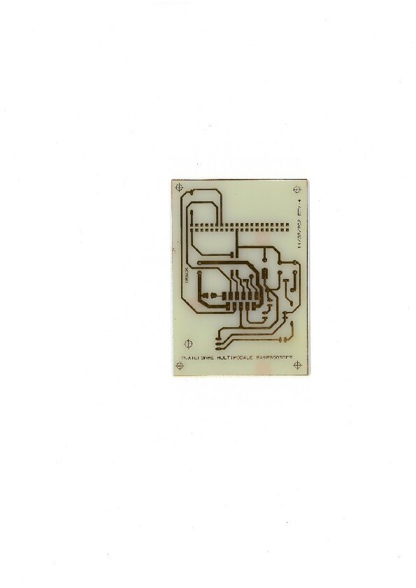

DCC
===

**DCC** ( *digital control system* ) is a standard used in model railroading to control individual locomotives or track accessories by modulating 
the supply voltage of the track.

The locomotives and their accessories (lights, effects) as well as the network accessories each have a unique address. 
The coded signal sent on the track gives commands to the equipment while providing power.

Principle
=========
                                                    
        The role of the **DCC** standard is to generate an electrical signal in binary to send information to locomotives or accessories. 
A sequence of 0 and 1 which are electrically translated by long positive and negative alternations (100us) for the 0 and short (58us) for the 1. 
The terminals on the circuit (locomotives and accessories) are equipped with decoders that translate these binary messages into commands.
		
Équipments                                   
===========
* A control unit consisting of an electronic board and a motor board whose purpose is to modulate the track voltage.
* Mobile (locomotives ) or fixed equipment (lights) that are equipped with decoders to interpret control signals.

### The control center

        
It can be either manual or automated.
For automation there are control software available under linux.
As control software we can use:
 * an Atmega 328 /2560 microcontroller.
 * an Arduino Uno / Mega
 * RaspberryPI 
 
There are APIs on github that allow us to use one of the maps if on it.
    It is also noted that the Arduino and Atmega use open source DCC++ [locoduino ](https://www.locoduino.org/spip.php?article182) while the raspberryPI uses 
    a python API [dccpi](https://github.com/hsanjuan/dccpi) 

The motor board (the booster)
=============================

 The choice to use an engine card is motivated by the fact that Arduino or RaspberryPi cards are not able to provide enough power.
    However, the principle of the DCC standard is to circulate "control" information in the power circuit (the rails), hence the importance of having a engine board.
    As a choice of motor board we will use LMD18200. T
    his board keeps the shape of the voltage of the signal present at their input (so the information) and amplifies the output signal. 
    The shape of the impulses is kept in order to keep the transmitted codes.

The RaspberryPI with dccpi API
===============================
It uses the API _dccpi_ that can be installed with  `sudo pip install dccpi`
 
This module implements the DCC protocol for controlling model trains using a Raspberry Pi.
It is able to output direction and speed DCC-encoded packets on one of the GPIO pins.

Hardware requirements
=====================
* A Raspberry Pi (developed/tested on model B+)
* DCC-decoder-equipped locomotives and tracks. (see the image below)
* Booster (LMD 18200)
* Note dccpi does not yet implement any advanced features like decoder registry operations (i.e. set address), you must ensure the decoder address before implementing it otherwise you risk registering the loco on the wrong address

BOOSTER_TYPON
=============
	 

Link that may be useful to understand how the information is decoded

[Train_miniature](http://stephane.ravaut.free.fr/Train_miniature/LE_DCC/Le_DCC_Comment_ca_marche.html)

