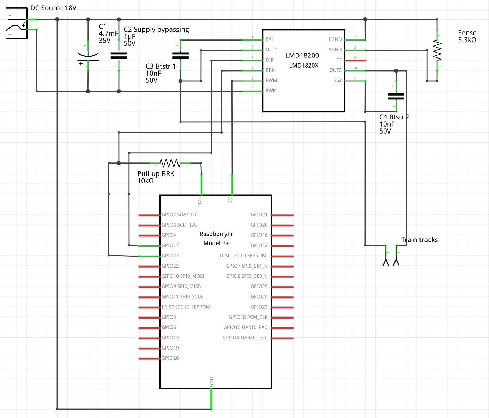
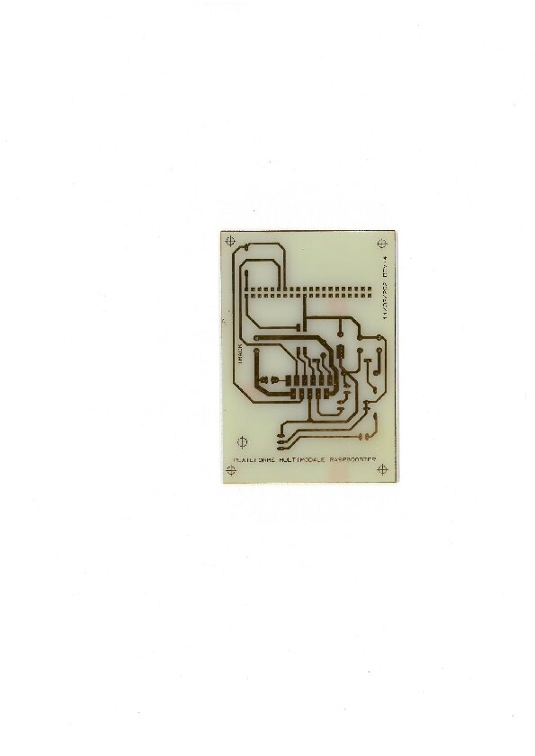
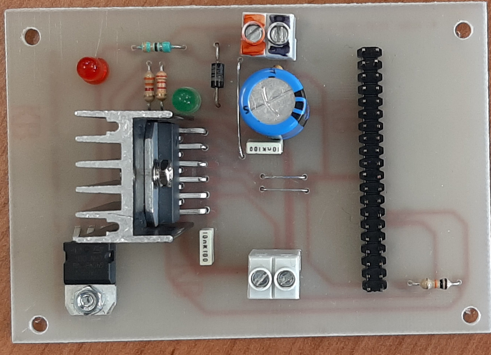

How to build a booster for the train API
^^^^^^^^^^^^^^^^^^^^^^^^^^^^^^^^^^^^^^^^
To drive the trains, the Raspberry does not provide enough power. You therefore need an amplifier capable of amplifying the signal coming out of the Raspberry without modifying it.
This is the role of the booster.

.. Note::
   I was inspired by the schema used by `booster <https://github.com/hsanjuan/dccpi/blob/master/dcc_booster_schem.png>`_ and made some modifications to it.
   

List of components
-------------------
* Regulateur : CI1 L7805
* Pont H :  CI2 LMD18200
* Resistances : R1 10 kOHMS, R2 2 KOHMS, R3 3.3 KOHMS, R4 330 kOHMS
* LEDS : D1 verte 5MM, D2 rouge 5MM
* Diode : D3 1N4007
* Condennsateur C1 4.7UF, C2 1UF, C3 10NF, C4 10NF
* Connecteurs 40 Points au pas 2.54MM
* Borniers 2 Contacts au pas 5.08 MM
   

Here is an image of how the artwork and the working prototype look like

