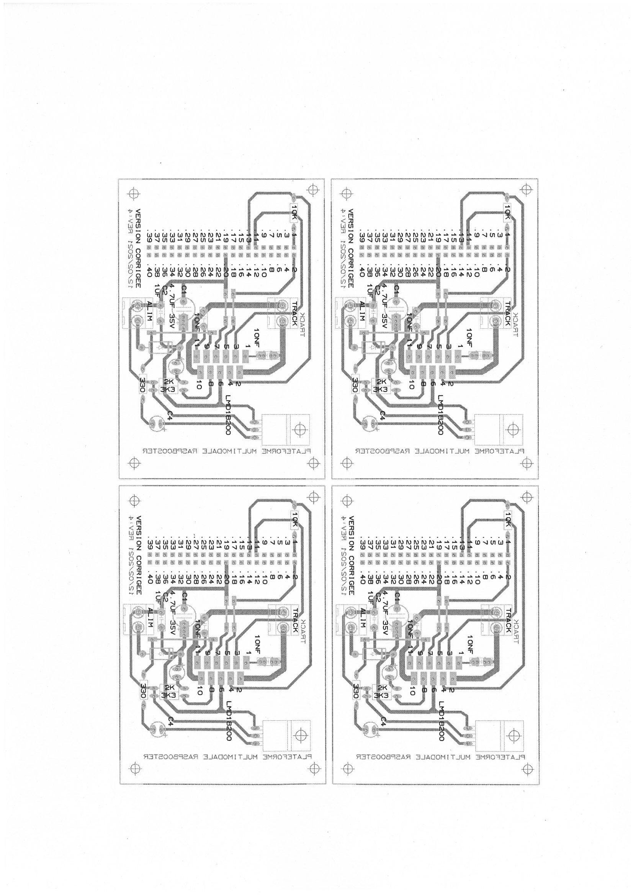

Speedlib documentation
======================

**SPEEDLIB** is a python library developped as a part of the SPEED project which allows us to control trains with the DCC protocol 
as well as the portic of the faller brand. It is made up of 2 librairies:
* The trains librairies which controls the trains
* The cranes library which controls the cranes

.. Warning::
    Since Speedlib is made up of two libraries, one for trains and the other for cranes, the library using trains
    only works on a RaspberryPI. It would be preferable to install Speedlib directly on a RaspberryPI in order to be able
    to use the train and crane API.

Software requirements
^^^^^^^^^^^^^^^^^^^^^
* python_requires = `>=3.6`
* `dccpi` : It should be auto-feched when installing speedlib. If not, you can download it here : `dccpi <https://pypi.org/project/dccpi/>`_
* `bitstring` module details. Should be auto-fetched when installing with pip.
* `wiringPi` : download and install `wiringPi <http://wiringpi.com/download-and-install/>`_
* Since wiringPi uses low-level mechanisms to access pins, dccpi programs must be run as root

Hardware requirements
^^^^^^^^^^^^^^^^^^^^^

For the trains
--------------
* A Raspberry Pi (developed/tested on model B+)
* DCC-decoder-equipped locomotives and tracks.
* The Raspberry Pi needs an additional booster circuit to actually provide the signal to the tracks. (See the photo of the artwork below)

For the cranes
---------------
* Faller brand portics

Installation
^^^^^^^^^^^^
To install Speedlib, open a new Terminal window and type the following command

* From pip
    >>> pip install speedlib

* From source
    Clone the project in a local directory with `Speedlib <https://github.com/CRIStAL-PADR/Speed.git>`_ 
    Then enter the following command line to install it

    >>> sudo python setup.py install

Tests
^^^^^
To starts the unit tests you can do:

cd tests/
    >>> PYTHONPATH=../ python3 -m unittest

Controlling a DCC train model
^^^^^^^^^^^^^^^^^^^^^^^^^^^^^
Here is an example of how to use the Train library to control a locomotive and its accessories

We will first import the train library that will allow us to control the locomotive as well as the accessories
    >>> from speedlib.trains import dcc
    >>> from speedlib.trains.dcc import Train

Once we have imported the library, we will initialize the trains by specifying the address and the name of the locomotive
    >>> train1 = Train("DCC1", 1)
    >>> train3 = Train("DCC3", 3)

.. Warning::
    Speedlib is not yet able to set the addresses so make sure to put the correct address of the decoder otherwise it will not work.
    Likewise, the different instantiated trains must not have the same name or the same address.

Now we can remove break signal by starting the controller
    >>> dcc.start()

We can then change the speed of the train, slow down, accelerate or even turn on one of the functions used by the accessories.
    >>> train1.speed = 14
    >>> train1.faster()
    >>> train1.slower()
    >>> train1.fl = True 

To obtain information on the locomotive or accessories, we can just do a print
    >>> print(train1)
    >>> print(train1.speed)
    >>> print(train1.f1)

Nous avons deux moyens d'arrêter le train : 

Mettre la vitesse à 0 ou à une valeur inférieur à 5
    >>> train1.speed = 0
    >>> print(train1.speed)

Make an emergency stop by activating the brake signal on the tracks
    >>> dcc.stop()

.. Warning::
   Always properly stop the program as we have seen below. Otherwise locos will receive DC current directly, and either burn or turn into DC mode (at full speed). 

Controlling a Faller (c) crane model
^^^^^^^^^^^^^^^^^^^^^^^^^^^^^^^^^^^^
Here is an example of how to use the Crane library to control cranes

To start, we will first import the crane library
    >>> from speedlib.cranes import faller
    >>> from speedlib.cranes.faller import Crane

After that, we will enter the ip addresses of the server contained in the microcontroller and then create our cranes.
    >>> ip_1 = "172.17.217.217"
    >>> ip_2 = "172.17.217.217"
    >>> crane_1 = Crane()
    >>> crane_2 = Crane()

We can now initialize cranes that we have just created.
The initialization allows us to retrieve the ip address of the second engine to which the Spreader and Crab are connected.
    >>> crane_1.init(ip_1)
    >>> crane_2.init(ip_2)

We can then control the motor of the crane.With the start_for function you can move the MotorChassis forward or backward for example.
    >>> crane_2.start_for(20*faller.ureg.millisecond,faller.MotorChassis,faller.MotorDirectionForward)

On peut également changer la vitesse avec la méthode change_speed ou donner une vitesse avec la méthode set_speed
    >>> crane_1.change_speed(faller.MotorCrab, -40)
